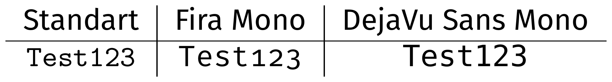

# Fonts

## Dateien

| Datei                                                | Beschreibung                               |
|------------------------------------------------------|--------------------------------------------|
| [README.md](README.md)                               | Diese Datei hier                           |
| [main.tex](main.tex)                                 | **START** Die Datei zum Start des Kapitels |
| [solution.tex](solution.tex)                         | Live-Edits und Lösung der Aufgaben         |
| [FontStyle_Cheatsheet.tex](FontStyle_Cheatsheet.tex) | Cheat Sheet für Schriftgröße/-stil         |
| [FontStyle_Cheatsheet.pdf](FontStyle_Cheatsheet.pdf) | Cheat Sheet PDF                            |


## Usage

Zum Rendern der `.tex`-Dateien folgenden Befehl verwenden:

```
pdflatex --shell-escape -synctex=1 -interaction=nonstopmode "main".tex
```


## Resourcen

- [Cheat Sheet](FontStyle_Cheatsheet.pdf)
- [Mathematisches Cheat Sheet][heinkenCheat]
- [Font Catalogue][Font Catalogue]
  - [Comic Neue][Comic Neue]


# Aufgaben

## Aufgabe 4: Neue Monospaced Schriftart

Suche dir im [LaTeX Font Catalogue][Font Catalogue] eine neue Typewriter-Font aus,
die die **Computer Modern** Monospace Schriftart ersetzt.
(Ich empfehle **Fira Mono** oder **DejaVu Sans Mono**)




## Aufgabe 5: Awesome Fonts

Neben den normalen Schriftarten gibts auch andere witzige Dinge.

Deine Aufgabe ist es folgende Sequenz von Symbolen anzugeben:


Dein Startpunkt ist [CTAN][fontawesome5].


[Font Catalogue]: https://tug.org/FontCatalogue/
[fontawesome5]: https://www.ctan.org/pkg/fontawesome5
[Comic Neue]: https://tug.org/FontCatalogue/comicneue/
[heinkenCheat]: https://www.caam.rice.edu/~heinken/latex/symbols.pdf
