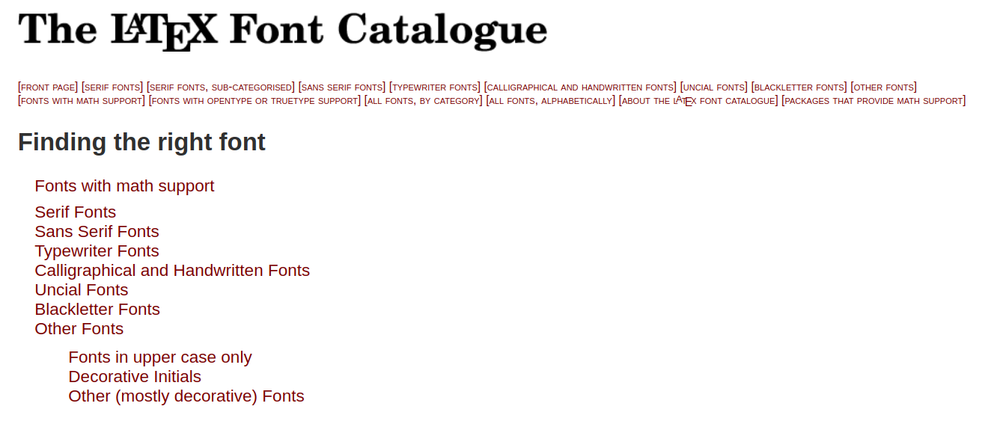

# Inhalt
- Eigene Commands `\newcommand`, `\renewcommand`
    - `\mathbb{R}` $\Rightarrow \mathbb{R} \Leftarrow$ `\bbR`
- Eigene Umgebungen `\newenvironment`, `\renewenvironment`
- Andere Schriftarten
    - `\textsc`, `\texttt`,...
    - [LaTeX Font Catalogue][Fonts] with [Comic Neue][Comic Sans]
- Eigene Packages
- Markdown & `pandoc`


# Einleitung

Im Verlauf des Workshops wird an der
[typischen Tübinger-Info TeX-Vorlage][TechInfo Template] herumeditiert.


# Commands

Commands ohne Argument:

> `\leq` $\Rightarrow \leq$

Commands **mit** _[optionalen]_ Argumenten:

> `\sqrt{4}`    $\Rightarrow \sqrt{4}$
>
> `\sqrt[3]{4}` $\Rightarrow \sqrt[3]{4}$

Zum Benutzen gibt es ein [**LATEX Mathematical Symbols**][heinkenCheat]
und zum verstehen der Befehle `\newcommand` und `\renewcommand`
gibts die [Overleaf Dokumentation][Overleaf Command][^3].

## `\newcommand`

```latex
\newcommand{name}[n][defaultFirst]{body}
```

* `name`: Name des Befehls
* `n`: Anzahl von Parametern
* `defaultFirst`: Standartwert für ersten Parameter
* `body`: Hier werden Parameter mittels `#x`, $x \in \{1,...,n\}$ verwendet

### Beispiel: `\hello`

Wir wollen einen Befehl, der Leute grüßt. Der sieht so aus:

```latex
\newcommand{\hello}[1][Phi]{Hallo #1, wie geht's so?}
```

und verhält sich so:

```latex
>> \hello
Hallo Phi, wie geht's so?
>> \hello[Jules]
Hallo Jules, wie geht's so?
```

## `\renewcommand`

99% identisch zu `\newcommand`

```latex
\renewcommand{name}[n][defaultFirst]{body}
```

* `name`: Name des Befehls
* `n`: Anzahl von Parametern
* `defaultFirst`: Standartwert für ersten Parameter
* `body`: Hier werden Parameter mittels `#x`, $x \in \{1,...,n\}$ verwendet

Das Überschreiben von Befehlen geht ohne Probleme.

```latex
>> $\Box\square$
□□
>> \renewcommand{\square}{^2}
>> $\Box\square$
□²
```


# Environments

Die bekannte Umgebung **`table`**:

```latex
\begin{table}
    \begin{tabular}{l|c}
        Workshop & Teilnehmer \\
        \hline
        Bash     & 20 \\
        Git      & 20 \\
        Python   & 20 \\
        LaTeX    & 20 \\
        \dots
    \end{tabular}
    \caption{Teilnehmer}
\end{table}
```

| Workshop | Teilnehmer |
|:---------|:----------:|
| Bash     | 20         |
| Git      | 20         |
| Python   | 20         |
| LaTeX    | 20         |

Soweit alter Schuh. Jetzt wollen wir selber Umgebungen schreiben.

## `\newenvironment`

Eine Ähnlichkeit zu `\newcommand` existiert.

```latex
\newenvironment{name}[n]{before}{after}
```

* `name`: Name des Befehls
* `n`: Anzahl von Parametern
* `before`: Der Code der _vor_ dem Inhalt kommt
* `body`: Der Code der _nach_ dem Inhalt kommt

Zwischen **`before`** und **`after`** landet der Code, der zwischen `\begin{name}`
und `\end{name}` geschrieben werden soll.

### `\newenvironment` mit Nummerierung

`\ŧable`, `\figure` usw. haben eine Zahl, die mit hochzählt. Sowas wollen wir
auch bauen können.

```latex
\newcounter{name}           % Zähler anlegen
\newenvironment{name}[n][defaultFirst]{
    \refstepcounter{name}   % Referenzieren zum Inkrementieren
    \thename                % Zahl abrufen
    before
}{after}
```

(Das funktioniert so auch in normalen _Commands_. Siehe **`\section`**.)

## Beispiel `\newenvironment`

```latex
\newenvironment{para}[1]{
    \begin{minipage}{1.5em}
        \rotatebox{90}{\textsc{#1}}
    \end{minipage}\begin{minipage}{\linewidth}
}{
    \end{minipage}\smallskip
}
```

- `minipage` ermöglicht es horizontal "Boxen" anzulegen.
- `\rotatebox[Winkel]{Inhalt}` dreht den Inhalt um den angegebenen Winkel.


## Beispiel `\newenvironment` mit Nummerierung

Lass uns einen Witze-Katalog anlegen. Der soll indiziert sein. Also können wir
die Umgebung so definieren.

```latex
\newcounter{joke}
\newenvironment{joke}[1]{
    \refstepcounter{joke}
    \noindent\colorbox{gray!50!white}{
        \textbf{Witz~\thejoke}
    } \\[.5em]
}{\medskip}
```

## `\renewenvironment`

```latex
\renewenvironment{name}[n][defaultFirst]{before}{after}
```

Auch hier gibt es wieder ein `\renewenvironment`. Es verhält sich genauso wie
`\newenvironment` und überschreibt die vorher definierte/importierte Umgebung.


# Aufgaben

## Aufgabe 1: Zahlenräume

Es gibt den Befehl `\mathbb{}` für den Mathe-Modus.
`\mathbb{R}` $\Rightarrow \mathbb{R}$

Schreibe
$$ \mathbb{N}\subset\mathbb{Z}\subset\mathbb{Q}\subset\mathbb{R}\subset\mathbb{C} $$

mittels Custom Commands nach dem Muster
`\bbR` $\Rightarrow \mathbb{R}$ oder `\bb{R}` $\Rightarrow \mathbb{R}$


## Aufgabe 2: Aufgaben-Section mit Punkten

Ziemlich was der Titel sagt. Entwerfe einen Befehl `\aufgabe`, der zwei Argumentenjjj
erwartet:

- Nummer der Aufgabe
- Punkte für die Aufgabe

Hilfreiche Befehle sind `\section*` und `\hfill`.
Optional sind `\small` und `\textcolor{color}{text}`.


## Aufgabe 3: Lösungs-Umgebung

Entwerfe eine Umgebung `löesung`, die den Text "**Lösung**:" als Präfix besitzt.
Der Präfix ist der einzige und optionale Parameter.

Hilfreiche Befehle:

- `\medskip` vertikale Lücke
- `\noindent` keine Einrückung
- `\textbf{}` Fett geschrieben


# Fonts


Schrift macht ein Dokument erst zugänglich. Wie wir mit Schriftarten, -stilen und
-größen arbeiten kommt jetzt.

## Font Styles

Font Sizes in Tex:

| `\tiny`              | `\scriptsize`             | `\footnotesize`             | `\small`             | `\normalsize`             |
|----------------------|---------------------------|-----------------------------|----------------------|---------------------------|
| $\text{\tiny Text}$  | $\text{\scriptsize Text}$ | $\text{\footnotesize Text}$ | $\text{\small Text}$ | $\text{\normalsize Text}$ |

| `\large`             | `\Large`                  | `\LARGE`                    | `\huge`              | `\Huge`                   |
|----------------------|---------------------------|-----------------------------|----------------------|---------------------------|
| $\text{\large Text}$ | $\text{\Large Text}$      | $\text{\LARGE Text}$        | $\text{\huge Text}$  | $\text{\Huge Text}$       |

Verwendung von `\tiny`:

```latex
{\tiny So werden die Schriftgrößen verwendet!}
```

$$\text{\tiny So werden die Schriftgrößen verwendet!}$$

Font Styles für Text im Mathe-Modus, sowie den Text-Modus (es gibt da noch mehr):

| Mathe Text Style  |                | Text Style      |                        |
|-------------------|----------------|-----------------|------------------------|
| `$\mathcal{A}$`   | $\mathcal{A}$  | `\textbf{Text}` | $\text{\textbf{Text}}$ |
| `$\mathbb{A}$`    | $\mathbb{A}$   | `\textit{Text}` | $\text{\textit{Text}}$ |
| `$\mathfrak{A}$`  | $\mathfrak{A}$ | `\texttt{Text}` | $\text{\texttt{Text}}$ |
| `$\mathsf{A}$`    | $\mathsf{A}$   | `\textsf{Text}` | $\text{\textsf{Text}}$ |
| `$\mathbf{A}$`    | $\mathbf{A}$   | `\textrm{Text}` | $\text{\textrm{Text}}$ |

Alles groß-/kleinschreiben ist kein Problem:

| `\uppercase{LaTeX}`        | `\lowercase{LaTeX}`        |
|----------------------------|----------------------------|
| $\text{\uppercase{LaTeX}}$ | $\text{\lowercase{LaTeX}}$ |


## Andere Fonts

> "Schriftarten, die nicht "häufig" vorkommen, sind verdammt nervig."

**MiKTeX**, **TeX Live** werden mit einer Auswahl von Schriftarten ausgeliefert.[^5]

[][Font Catalogue]

### Dokumenten-Schriftart

Der Standart-Weg um **dokumentenweit** Fonts einzustellen (unter *pdf(La)TeX* und
*MiKTeX*) ist folgender:

```latex
\usepackage[T1]{fontenc}
\usepackage{fontname}
```

Die PDF-Engines *Xe(La)TeX* und *Lua(La)TeX* verwenden das Package `fontspec` und
sind iA. besser im Umgang mit Schriftarten.

### Beispiel (Comic Sans-ish):

Das wir jetzt Schriftarten verändern können mißbrauchen wir direkt:

```latex
\usepackage[T1]{fontenc}
\usepackage[default]{comicneue}
```

### Inline Schriftart

In **Word** kann man einzelne Textschnipsel in verschiedenen Schriftarten schreiben.
Geht das in TeX auch? **Ja, aber umständlicher.**

### Beispiel (Inline):

```latex
Hier steht was
{\fontfamily{ComicNeue-TLF}\selectfont Hier Comic Neue.}
Hier wieder nicht.
```

Wir können auch einen (Text-)Befehl anlegen.

```latex
\newcommand{\comicneue}{\fontfamily{ComicNeue-TLF}\selectfont}
\DeclareTextFontCommand{\textcn}{\comicneue}
```

Der Befehl **`\textcn`** wird dann so verwendet wie `\textbf`, `\textrm`,
`\textsc`, ...

Die Frage ist jetzt aber: Wie kommen wir überhaupt auf **`ComicNeue-TLF`**?

1. Gewünschte Schriftart als Standart setzen (`\usepackage{...}`)
2. Im Text `\familydefault`
3. Dieser String ist die gesuchte `fontfamily`

### Beispiel (`\comicneue` / `\textcn`)

```latex
{\comicneue Hier steht etwas auf diese Weise} \\
\textcn{Hier steht etwas auf die andere Weise}
```


# Aufgaben

## Aufgabe 4: Neue Monospaced Schriftart

Suche dir im [LaTeX Font Catalogue][Font Catalogue] eine neue Typewriter-Font aus,
die die **Computer Modern** Monospace Schriftart ersetzt.
(Ich empfehle **Fira Mono** oder **DejaVu Sans Mono**)


## Aufgabe 5: Awesome Fonts

Neben den normalen Schriftarten gibts auch andere witzige Dinge.

Deine Aufgabe ist es folgende Sequenz von Symbolen anzugeben:


Dein Startpunkt ist [CTAN][fontawesome5].


# Packages
## Motivation

**Warum der Spaß?**

- Die Präambel läuft über / ist zu lang
- Viele Dokumente mit der selben / ähnlichen Präambel (Übungsblätter)
- Befehle mit anderen teilen

### Idee

Präambel in eine `settings.tex` packen. `\input{settings.tex}` anstatt der alten
Präambel.

## Einschub

**`\input` vs `\include`**

| `\input{filename}`                            | `\input{filename}`           |
|-----------------------------------------------|------------------------------|
| Importiert `filename.tex`                     | Importiert `filename.tex`    |
| Als ob Code in aufrufender Datei stehen würde | In Kompilation eigene Datei  |
| Befehle verwendbar                            | Befehle nicht verwendbar     |
|                                               | nützlich in großen Projekten |

## Was ist ein Package?

Eine Sammlung von Befehlen und Umgebungen, die in anderen Dokumenten eingesetzt
werden kann.
Nicht viel anders zu `settings.tex`-Lösung.

Die Unterschiede sind:

1. Dateiendung `.sty`
2. Einbindung mittels `\usepackage{packagename}`
3. Angabe des "Headers"
```latex
\NeedsTeXFormat{LaTeX2e}
\ProvidesPackage{packagename}[YYYY/MM/dd package description]
```
4. `\usepackage` $\to$ `\RequirePackage`

Besonderheiten:

- `\newcommand` kann weiter verwendet werden
- `\renewcommand` kann weiter verwendet werden
- `\providecommand` definiert Befehl, falls nicht schon vorher vorhanden
- `\CheckCommand` genau wie `\newcommand`, falls Befehl vorhanden und anders
  definiert als in `\CheckCommand` wird ein Fehler geworfen

Das lässt sich ausführlicher in der [Overleaf Dokumentation][Overleaf Package] nachlesen.[^1]


# Aufgaben

## Aufgabe 6: Alle Befehle sind schon da 🎵

Sind sie das? Funktionieren alle Befehle und Umgebungen in `uebungsblatt.sty`
ohne Probleme in einer anderen Datei?

Kommentiere `\EXERCISES` in `main.tex` aus.

Sorge dafür, dass das keinen Fehler wirft. Selbiges für die anderen Übungsblatt
spezifischen Befehle.


## Zusatzaufgabe 7: `\documentclass{uebungsblatt}`

Neben Packages gibt es noch Klassen. Benutzt und benötigt in jedem Dokument:

```latex
\documentclass[a4paper]{scratcl}
```

Schreibe `uebungsblatt.sty` zu `uebungsblatt.cls` um. Richte dich nach der
[Overleaf Dokumentation][Overleaf Class][^2].
Der [Artikel zum Unterschied von Package und Class][Overleaf Package v Class]
ist auch empfohlen.


# Markdown & `pandoc`

Nachdem wir uns jetzt bald 3h durch Latex gearbeitet haben, benutzt es nicht,
wenn ihr es nicht braucht. Und steigt dann nicht auf eine Office Software um,
wenn ihr die auch nicht braucht. Und wenn ihr das Gefühl habt, ihr braucht es,
denkt noch einen Moment drüber nach.

Markup-Sprachen oder eben **Markdown** machen es leicht. Und die Tools, die
darauf arbeiten, machen es noch leichter.

```markdown
# Was ist Markdown? Das ist Markdown!

- Markdown ist eine _simple_ Notation für Text, Notizen, usw.
- Wird von Git-hostern unterstützt (`.md`, `.markdown`)
- Ist als "Source-Code" menschenlesbar
- [Spezifikation](https://github.github.com/gfm)

```

Gibt verschiedene leicht unterschiedliche Spezifikationen, eine der meist
geschriebenen Varianten ist [Github Flavored Markdown (GFM)][gfmspec] oder
[CommonMark]. Diese unterscheiden sich kaum.

Zum rendern in PDF, Website, Ebook, Präsentationen, etc. verwenden wir
[Pandoc][pandoc][^6].

Der Befehl den wir in der Shell verwenden ist `pandoc`:

```sh
>>> pandoc --help
pandoc [OPTIONS] [FILES]
-f FORMAT, -r FORMAT    --from=FORMAT, --read=FORMAT
-t FORMAT, -w FORMAT    --to=FORMAT, --write=FORMAT
-o FILE                 --output=FILE
```

## Beispiele

Die folgenden Beispiele sind im `Makefile` verfügbar. Die Befehle stehen beim
Beispiel. Im `Makefile` sind auch noch ein paar weitere Befehle zum rumprobieren.


### Beispiel: Markdown zu Website

```sh
>>> pandoc -f markdown -t html -o info.html info.md
```

Makefile: `make info`


### Beispiel: Markdown zu PDF

```sh
>>> pandoc -f markdown -t pdf \
>     --pdf-engine=xelatex    \
>     -o default.pdf shownotes.md
```

Makefile: `make default` oder `make shownotes` (mit anderer Schriftart)


### Beispiel: Markdown zu Beamer Präsentation

```sh
>>> pandoc -f markdown -t beamer -o slides.pdf slides.md
```

Makefile: `make beamer` oder `make fancybeamer` (mit anderer Schriftart)


### Beispiel: Markdown zu Slidy Präsentation

```sh
>>> pandoc -f markdown -t slidy -s --mathjax
>     -o slidy.html slides.md
```

Makefile: `make slidy`


### Beispiel: Markdown zu revealJs Präsentation

```sh
>>> pandoc -f markdown -t revealjs -s --mathjax
>     -o revealjs.html slides.md
```

Markdown: `make revealjs`

Das war der Inhalt des Workshops. Danke fürs Teilnehmen!


[Overleaf Command]: https://www.overleaf.com/learn/latex/Commands
[Comic Sans]: https://tug.org/FontCatalogue/comicneue/
[heinkenCheat]: https://www.caam.rice.edu/~heinken/latex/symbols.pdf
[Font Catalogue]: https://tug.org/FontCatalogue/
[fontawesome5]: https://www.ctan.org/pkg/fontawesome5
[Overleaf Package]: https://www.overleaf.com/learn/latex/Writing_your_own_package
[Overleaf Class]: https://www.overleaf.com/learn/latex/Writing_your_own_class
[Overleaf Package v Class]: https://www.overleaf.com/learn/latex/Understanding_packages_and_class_files
[pandoc]: https://pandoc.org
[gfmspec]: https://github.github.com/gfm/
[CommonMark]: http://commonmark.org/

[TechInfo Template]: https://www.overleaf.com/latex/templates/template-for-theoretische-informatik-uni-tubingen/xwsycshfkjtf


[^1]: [Overleaf Dokumentation: Packages][Overleaf Package]
[^2]: [Overleaf Dokumentation: Classes][Overleaf Class]
[^3]: [Overleaf Dokumentaiton: Commands][Overleaf Command]
[^5]: [The LaTeX Font Catalogue][Font Catalogue]
[^6]: [Pandoc][pandoc] "a universal document converter"
