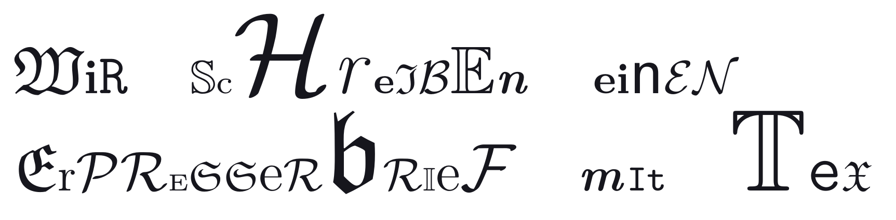

# Inhalt
- Eigene Commands `\newcommand`, `\renewcommand`
    - `\mathbb{R}` $\Rightarrow \mathbb{R} \Leftarrow$ `\bbR`
- Eigene Umgebungen `\newenvironment`, `\renewenvironment`
- Andere Schriftarten
    - `\textsc`, `\texttt`,...
    - [LaTeX Font Catalogue][Fonts] with [Comic Neue][Comic Sans]
- Eigene Packages
- Markdown & `pandoc`

---

# Commands[^3]

Commands ohne Argument:

> `\leq` $\Rightarrow \leq$

Commands **mit** _[optionalen]_ Argumenten:

> `\sqrt{4}`    $\Rightarrow \sqrt{4}$
>
> `\sqrt[3]{4}` $\Rightarrow \sqrt[3]{4}$

A compiled cheat sheet for [**LATEX Mathematical Symbols**][heinkenCheat]

---

# `\newcommand`

```latex
\newcommand{name}[n][defaultFirst]{body}
```

* `name`: Name des Befehls
* `n`: Anzahl von Parametern
* `defaultFirst`: Standartwert für ersten Parameter
* `body`: Hier werden Parameter mittels `#x`, $x \in \{1,...,n\}$ verwendet

---

# `\newcommand`

```latex
\newcommand{\hello}[1][Phi]{Hallo #1, wie geht's so?}
```

```latex
>> \hello
Hallo Phi, wie geht's so?
>> \hello[Jules]
Hallo Jules, wie geht's so?
```

---


# `\renewcommand`

99% identisch zu `\newcommand`

```latex
\renewcommand{name}[n][defaultFirst]{body}
```

* `name`: Name des Befehls[^4]
* `n`: Anzahl von Parametern
* `defaultFirst`: Standartwert für ersten Parameter
* `body`: Hier werden Parameter mittels `#x`, $x \in \{1,...,n\}$ verwendet


---

# `\renewcommand`

```latex
>> $\Box\square$
□□
>> \renewcommand{\square}{^2}
>> $\Box\square$
□²
```


---

# Environments

Die bekannte Umgebung **`table`**:

```latex
\begin{table}
    \begin{tabular}{l|c}
        Workshop & Teilnehmer \\
        \hline
        Bash     & 20 \\
        Git      & 20 \\
        Python   & 20 \\
        LaTeX    & 20 \\
        \dots
    \end{tabular}
    \caption{Teilnehmer}
\end{table}
```

---

# Environments

Die bekannte Umbgebung **`table`**:

| Workshop | Teilnehmer |
|:---------|:----------:|
| Bash     | 20         |
| Git      | 20         |
| Python   | 20         |
| LaTeX    | 20         |


---

# `\newenvironment`

Ähnlichkeit zu `\newcommand` existiert.

```latex
\newenvironment{name}[n]{before}{after}
```

* `name`: Name des Befehls
* `n`: Anzahl von Parametern
* `before`: Der Code der _vor_ dem Inhalt kommt
* `body`: Der Code der _nach_ dem Inhalt kommt

Zwischen **`before`** und **`after`** landet der Code, der zwischen `\begin{name}`
und `\end{name}` geschrieben.

---

# `\newenvironment` mit Nummerierung

```latex
\newcounter{name}           % Zähler anlegen
\newenvironment{name}[n][defaultFirst]{
    \refstepcounter{name}   % Referenzieren zum Inkrementieren
    \thename                % Zahl abrufen
    before
}{after}
```

Funktioniert so auch in normalen _Commands_. Siehe **`\section`**.


---

# Beispiel `\newenvironment`

```latex
\newenvironment{para}[1]{
    \begin{minipage}{1.5em}
        \rotatebox{90}{\textsc{#1}}
    \end{minipage}\begin{minipage}{\linewidth}
}{
    \end{minipage}\smallskip
}
```

- `minipage` ermöglicht es horizontal "Boxen" anzulegen.
- `\rotatebox[Winkel]{Inhalt}` dreht den Inhalt um den angegebenen Winkel.


---

# Beispiel `\newenvironment` mit Nummerierung

```latex
\newcounter{joke}
\newenvironment{joke}[1]{
    \refstepcounter{joke}
    \noindent\colorbox{gray!50!white}{
        \textbf{Witz~\thejoke}
    } \\[.5em]
}{\medskip}
```

---

# `\renewenvironment`

```latex
\renewenvironment{name}[n][defaultFirst]{before}{after}
```

Auch hier gibt es wieder ein `\renewenvironment`. Es verhält sich genauso wie
`\newenvironment` und überschreibt die vorher definierte/importierte Umgebung.


---

# Aufgabe 1: Zahlenräume

Es gibt den Befehl `\mathbb{}` für den Mathe-Modus.
`\mathbb{R}` $\Rightarrow \mathbb{R}$

Schreibe
$$ \mathbb{N}\subset\mathbb{Z}\subset\mathbb{Q}\subset\mathbb{R}\subset\mathbb{C} $$

mittels Custom Commands nach dem Muster
`\bbR` $\Rightarrow \mathbb{R}$ oder `\bb{R}` $\Rightarrow \mathbb{R}$


---

# Aufgabe 2: Aufgaben-Section mit Punkten

Ziemlich was der Titel sagt. Entwerfe einen Befehl `\aufgabe`, der zwei Argumenten
erwartet:

- Nummer der Aufgabe
- Punkte für die Aufgabe

Hilfreiche Befehle sind `\section*` und `\hfill`.
Optional sind `\small` und `\textcolor{color}{text}`.


---

# Aufgabe 3: Lösungs-Umgebung

Entwerfe eine Umgebung `löesung`, die den Text "**Lösung**:" als Präfix besitzt.
Der Präfix ist der einzige und optionale Parameter.

Hilfreiche Befehle:

- `\medskip` vertikale Lücke
- `\noindent` keine Einrückung
- `\textbf{}` Fett geschrieben


---

# Fonts




---

# Font Styles

Font Sizes in Tex:

| `\tiny`              | `\scriptsize`             | `\footnotesize`             | `\small`             | `\normalsize`             |
|----------------------|---------------------------|-----------------------------|----------------------|---------------------------|
| $\text{\tiny Text}$  | $\text{\scriptsize Text}$ | $\text{\footnotesize Text}$ | $\text{\small Text}$ | $\text{\normalsize Text}$ |

| `\large`             | `\Large`                  | `\LARGE`                    | `\huge`              | `\Huge`                   |
|----------------------|---------------------------|-----------------------------|----------------------|---------------------------|
| $\text{\large Text}$ | $\text{\Large Text}$      | $\text{\LARGE Text}$        | $\text{\huge Text}$  | $\text{\Huge Text}$       |

Verwendung von `\tiny`:

```latex
{\tiny So werden die Schriftgrößen verwendet!}
```

$$\text{\tiny So werden die Schriftgrößen verwendet!}$$


---

# Font Styles

Font Styles für Text im Mathe-Modus, sowie den Text-Modus:

| Mathe Text Style  |                | Text Style      |                        |
|-------------------|----------------|-----------------|------------------------|
| `$\mathcal{A}$`   | $\mathcal{A}$  | `\textbf{Text}` | $\text{\textbf{Text}}$ |
| `$\mathbb{A}$`    | $\mathbb{A}$   | `\textit{Text}` | $\text{\textit{Text}}$ |
| `$\mathfrak{A}$`  | $\mathfrak{A}$ | `\texttt{Text}` | $\text{\texttt{Text}}$ |
| `$\mathsf{A}$`    | $\mathsf{A}$   | `\textsf{Text}` | $\text{\textsf{Text}}$ |
| `$\mathbf{A}$`    | $\mathbf{A}$   | `\textrm{Text}` | $\text{\textrm{Text}}$ |


Alles groß-/kleinschreiben ist kein Problem:

| `\uppercase{LaTeX}`        | `\lowercase{LaTeX}`        |
|----------------------------|----------------------------|
| $\text{\uppercase{LaTeX}}$ | $\text{\lowercase{LaTeX}}$ |


---

# Andere Fonts

> "Schriftarten, die nicht "häufig" vorkommen, sind verdammt nervig."

**MiKTeX**, **TeX Live** werden mit einer Auswahl von Schriftarten ausgeliefert.[^5]

[][Font Catalogue]


---

# Dokumenten-Schriftart

Der Standart-Weg um **dokumentenweit** Fonts einzustellen (unter *pdf(La)TeX* und
*MiKTeX*).

```latex
\usepackage[T1]{fontenc}
\usepackage{fontname}
```

*Xe(La)TeX* / *Lua(La)TeX* verwenden das Package `fontspec` und sind iA. besser
im Umgang mit Schriftarten.

---

# Beispiel (Comic Sans-ish):

```latex
\usepackage[T1]{fontenc}
\usepackage[default]{comicneue}
```


---

# Inline Schriftart

In **Word** kann man einzelne Textschnipsel in verschiedenen Schriftarten schreiben.
Geht das in TeX auch? **Ja, aber umständlicher.**

## Beispiel (Inline):

```latex
Hier steht was
{\fontfamily{ComicNeue-TLF}\selectfont Hier Comic Neue.}
Hier wieder nicht.
```


---

# Inline Schriftart

Wir können auch einen (Text-)Befehl anlegen.

```latex
\newcommand{\comicneue}{\fontfamily{ComicNeue-TLF}\selectfont}
\DeclareTextFontCommand{\textcn}{\comicneue}
```

**`\textcn`** wird dann so verwendet wie `\textbf`, `\textrm`, `\textsc`, ...

Wie kommen wir überhaupt auf **`ComicNeue-TLF`**?

1. Gewünschte Schriftart als Standart setzen (`\usepackage{...}`)
2. Im Text `\familydefault`
3. Dieser String ist die gesuchte `fontfamily`


---

# Beispiel (`\comicneue` / `\textcn`)

```latex
{\comicneue Hier steht etwas auf diese Weise} \\
\textcn{Hier steht etwas auf die andere Weise}
```


---

# Aufgabe 6: Neue Monospaced Schriftart

Suche dir im [LaTeX Font Catalogue][Font Catalogue] eine neue Typewriter-Font aus,
die die **Computer Modern** Monospace Schriftart ersetzt.
(Ich empfehle **Fira Mono** oder **DejaVu Sans Mono**)


---

# Aufgabe 5: Awesome Fonts

Neben den normalen Schriftarten gibts auch andere witzige Dinge.

Deine Aufgabe ist es folgende Sequenz von Symbolen anzugeben:


Dein Startpunkt ist [CTAN][fontawesome5].


---

# Packages

**Warum der Spaß?**

- Die Präambel läuft über / ist zu lang
- Viele Dokumente mit der selben / ähnlichen Präambel (Übungsblätter)
- Befehle mit anderen teilen

**Idee**

Präambel in eine `settings.tex` packen. `\input{settings.tex}` anstatt der alten
Präambel.


---

## Einschub

**`\input` vs `\include`**

| `\input{filename}`                            | `\input{filename}`           |
|-----------------------------------------------|------------------------------|
| Importiert `filename.tex`                     | Importiert `filename.tex`    |
| Als ob Code in aufrufender Datei stehen würde | In Kompilation eigene Datei  |
| Befehle verwendbar                            | Befehle nicht verwendbar     |
|                                               | nützlich in großen Projekten |


---

# Was ist ein Package?

Eine Sammlung von Befehlen und Umgebungen, die in anderen Dokumenten eingesetzt
werden kann.
Nicht viel anders zu `settings.tex`-Lösung.

## Die Unterschiede sind:

1. Dateiendung `.sty`
2. Einbindung mittels `\usepackage{packagename}`
3. Angabe des "Headers"

```latex
\NeedsTeXFormat{LaTeX2e}
\ProvidesPackage{packagename}[YYYY/MM/dd package description]
```

4. `\usepackage` $\to$ `\RequirePackage`


---

# Was ist ein Package?

## Besonderheiten:

- `\newcommand` kann weiter verwendet werden
- `\renewcommand` kann weiter verwendet werden
- `\providecommand` definiert Befehl, falls nicht schon vorher vorhanden
- `\CheckCommand` genau wie `\newcommand`, falls Befehl vorhanden und anders
  definiert als in `\CheckCommand` wird ein Fehler geworfen


---

## Aufgaben

TODO


---

# Markdown & `pandoc`

```markdown
# Was ist Markdown? Das ist Markdown!

- Markdown ist eine _simple_ Notation für Text, Notizen, usw.
- Wird von Git-hostern unterstützt (`.md`, `.markdown`)
- Ist als "Source-Code" menschenlesbar
- [Spezifikation](https://github.github.com/gfm)

```


---

# Markdown & `pandoc`
## Pandoc

Zum rendern in PDF, Website, Ebook, Präsentationen, etc. verwenden wir
[Pandoc][pandoc].

```sh
>>> pandoc --help
pandoc [OPTIONS] [FILES]
-f FORMAT, -r FORMAT    --from=FORMAT, --read=FORMAT
-t FORMAT, -w FORMAT    --to=FORMAT, --write=FORMAT
-o FILE                 --output=FILE
```


---


# Markdown & `pandoc`
### Beispiel: Markdown zu Website

```sh
>>> pandoc -f markdown -t html -o info.html info.md
```


### Beispiel: Markdown zu PDF

```sh
>>> pandoc -f markdown -t pdf \
>     --pdf-engine=xelatex    \
>     -o default.pdf shownotes.md
```


---


# Markdown & `pandoc`
### Beispiel: Markdown zu Beamer Präsentation

```sh
>>> pandoc -f markdown -t beamer -o slides.pdf slides.md
```


### Beispiel: Markdown zu Slidy Präsentation

```sh
>>> pandoc -f markdown -t slidy -s --mathjax
>     -o slidy.html slides.md
```


### Beispiel: Markdown zu revealJs Präsentation

```sh
>>> pandoc -f markdown -t revealjs -s --mathjax
>     -o revealjs.html slides.md
```


---

# Danke fürs mitmachen!

Wenn ihr uns mitteilen wollt, wie es euch gefallen hat:
https://phictional.de/tutor/feedback


[Overleaf Package]: https://www.overleaf.com/learn/latex/Writing_your_own_package
[Overleaf Class]: https://www.overleaf.com/learn/latex/Writing_your_own_class
[Overleaf Command]: https://www.overleaf.com/learn/latex/Commands

[Fonts]: https://tug.org/FontCatalogue/
[Comic Sans]: https://tug.org/FontCatalogue/comicneue/
[heinkenCheat]: https://www.caam.rice.edu/~heinken/latex/symbols.pdf
[Font Catalogue]: https://tug.org/FontCatalogue/
[fontawesome5]: https://www.ctan.org/pkg/fontawesome5
[pandoc]: https://pandoc.org
[gfmspec]: https://github.github.com/gfm/
[CommonMark]: http://commonmark.org/

[TechInfo Template]: https://www.overleaf.com/latex/templates/template-for-theoretische-informatik-uni-tubingen/xwsycshfkjtf


[^1]: [Overleaf Package]
[^2]: [Overleaf Class]
[^3]: [Overleaf Command]
[^4]: [Overleaf]
[^5]: [The LaTeX Font Catalogue][Font Catalogue]
